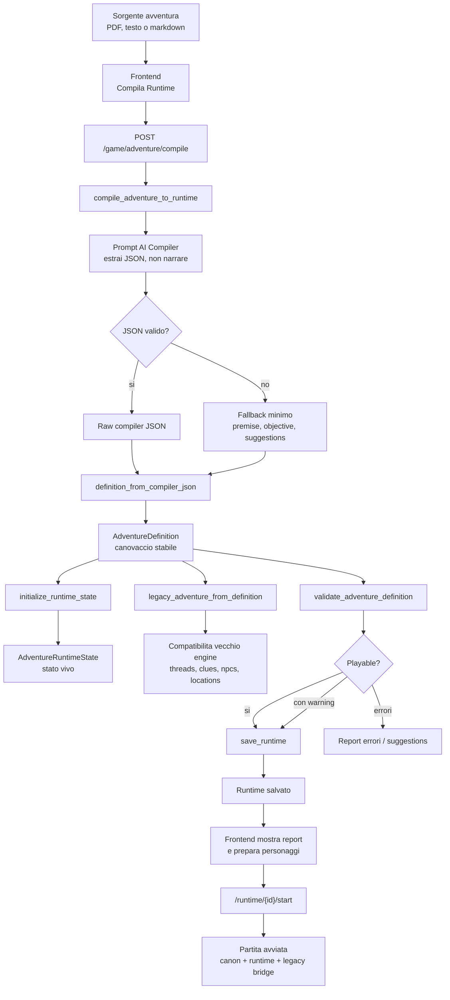
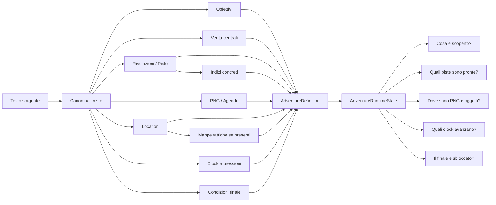

# Adventure Compiler Flowchart

Questo documento descrive, in formato riusabile, come il compiler legge, interpreta e rimpacchetta un'avventura in Pandora Legio / GURPS.

## JSON Per Infografica

```json
{
  "title": "Adventure Compiler - Lettura, interpretazione e runtime",
  "purpose": "Trasformare testo/PDF/markdown di avventura in una struttura stabile, simulabile e tracciabile.",
  "principle": "Il compiler non deve narrare al posto del Master: deve estrarre il canovaccio, fissare la verita e preparare uno stato runtime controllabile.",
  "entry_points": [
    {
      "id": "ui_compile_runtime",
      "label": "Frontend - Compila Runtime",
      "file": "frontend/src/App.jsx",
      "function": "handleRuntimeCompile",
      "input": ["content", "title", "genre_hint", "runtime_profile_hint", "source_type"],
      "output": "POST /game/adventure/compile"
    },
    {
      "id": "api_compile",
      "label": "Backend API",
      "file": "backend/App/main.py",
      "function": "adventure_compile",
      "input": "AdventureCompilePayload",
      "output": "runtime salvato e restituito al frontend"
    }
  ],
  "pipeline": [
    {
      "step": 1,
      "id": "source_ingestion",
      "label": "Ingestione sorgente",
      "what_happens": "Il testo dell'avventura viene ricevuto dal frontend. Se arriva da PDF, prima deve essere estratto in testo.",
      "input": "Testo grezzo dell'avventura",
      "output": "content normalizzato e troncato a circa 50000 caratteri",
      "risk": "Se il testo e troppo confuso o povero, il compiler puo creare fallback generici.",
      "guardrail": "Non inventare nuova trama se manca struttura: usare suggestions."
    },
    {
      "step": 2,
      "id": "ai_compile_prompt",
      "label": "Prompt Adventure Compiler",
      "file": "backend/App/claude_service.py",
      "function": "compile_adventure_to_runtime",
      "what_happens": "L'AI riceve l'istruzione di agire come compiler, non come narratore.",
      "input": ["content", "source_type", "title", "genre_hint", "runtime_profile_hint"],
      "output": "JSON grezzo con canovaccio strutturato",
      "required_fields": [
        "title",
        "genre",
        "runtime_profiles",
        "premise",
        "initial_hook",
        "core_truths",
        "objectives",
        "revelations",
        "clues",
        "actors",
        "locations",
        "event_clocks",
        "finale_conditions",
        "suggestions"
      ],
      "guardrails": [
        "Non scrivere prosa fuori dal JSON.",
        "Non inventare nuovo core plot salvo riparazioni minime.",
        "Mettere cio che manca in suggestions, non nel canon.",
        "Ogni clue deve collegarsi a una revelation.",
        "Ogni finale deve dipendere da obiettivi, indizi, clock o stato."
      ]
    },
    {
      "step": 3,
      "id": "json_parse_or_fallback",
      "label": "Parsing JSON o fallback",
      "file": "backend/App/claude_service.py",
      "function": "_extract_json_object",
      "what_happens": "Il backend prova a estrarre un oggetto JSON valido dalla risposta AI.",
      "success_output": "dict strutturato prodotto dal modello",
      "failure_output": "fallback minimo con titolo, genere, premise, objective e suggestions",
      "risk": "Un fallback e giocabile ma molto meno ricco."
    },
    {
      "step": 4,
      "id": "definition_normalization",
      "label": "Normalizzazione in AdventureDefinition",
      "file": "backend/App/adventure_compiler.py",
      "function": "definition_from_compiler_json",
      "what_happens": "Il JSON grezzo viene convertito in modelli runtime tipizzati.",
      "output_model": "AdventureDefinition",
      "normalizations": [
        "Genera id stabili quando mancano.",
        "Normalizza il genere in una chiave valida.",
        "Crea almeno un objective se manca.",
        "Crea revelation dalla verita centrale se mancano piste.",
        "Collega ogni clue a una revelation.",
        "Garantisce almeno 3 clue minimi se l'avventura e troppo povera.",
        "Crea almeno una location iniziale.",
        "Crea almeno un event clock principale.",
        "Crea una finale_condition principale se manca."
      ],
      "main_entities": [
        "HiddenTruth",
        "Objective",
        "Revelation",
        "RuntimeClue",
        "ActorState",
        "FactionState",
        "LocationState",
        "EventClock",
        "PressureSystem",
        "ResourceState",
        "FinaleCondition"
      ]
    },
    {
      "step": 5,
      "id": "runtime_state_initialization",
      "label": "Inizializzazione stato runtime",
      "file": "backend/App/adventure_compiler.py",
      "function": "initialize_runtime_state",
      "what_happens": "Dal canovaccio fisso viene creato lo stato vivo della partita.",
      "output_model": "AdventureRuntimeState",
      "runtime_tracks": [
        "current_scene_id",
        "active_objective_ids",
        "discovered_clue_ids",
        "partial_clue_ids",
        "active_revelation_ids",
        "ready_revelation_ids",
        "resolved_revelation_ids",
        "actor_runtime",
        "faction_runtime",
        "location_runtime",
        "clock_runtime",
        "pressure_runtime",
        "resource_runtime",
        "flags",
        "history"
      ]
    },
    {
      "step": 6,
      "id": "legacy_bridge",
      "label": "Bridge verso vecchio engine",
      "file": "backend/App/adventure_compiler.py",
      "function": "legacy_adventure_from_definition",
      "what_happens": "La nuova AdventureDefinition viene convertita anche nel formato vecchio usato dal Master e dal frontend esistente.",
      "output": "legacy_adventure",
      "maps_to": {
        "core_truths": "hidden_truth / adventure_canon.core_truth",
        "objectives": "win_condition",
        "event_clocks": "threat_description / threat_max_turns",
        "revelations": "story_threads",
        "clues": "clues",
        "actors": "npcs + npc_agenda",
        "locations": "locations + tactical_map"
      },
      "why_it_exists": "Permette al nuovo compiler di funzionare con il motore narrativo gia esistente."
    },
    {
      "step": 7,
      "id": "validation",
      "label": "Validazione giocabilita",
      "file": "backend/App/adventure_validator.py",
      "function": "validate_adventure_definition",
      "what_happens": "Controlla se la definizione e coerente e abbastanza completa per giocare.",
      "checks": [
        "Ogni clue deve collegarsi a una revelation valida.",
        "Ogni revelation deve avere clue o condizioni.",
        "Ogni objective deve avere success_conditions.",
        "Ogni finale_condition deve avere dipendenze esplicite.",
        "Gli attori devono avere ruolo e goal.",
        "Le location devono avere id, name, type e access_state.",
        "I clock devono avere max valido e conseguenza.",
        "I profili runtime richiedono elementi compatibili."
      ],
      "output": {
        "valid": "true se non ci sono errori bloccanti",
        "playable": "true se puo partire una partita",
        "errors": "problemi bloccanti",
        "warnings": "problemi da migliorare",
        "counts": "conteggio di obiettivi, location, attori, clue, revelation"
      }
    },
    {
      "step": 8,
      "id": "runtime_persistence",
      "label": "Salvataggio runtime compilato",
      "file": "backend/App/adventure_runtime_store.py",
      "function": "save_runtime",
      "what_happens": "Definition, runtime_state e validation_report vengono salvati come runtime caricabile.",
      "output": "runtime_id + dati compilati",
      "storage": "data/compiled_adventures in locale, /tmp/compiled_adventures su Vercel"
    },
    {
      "step": 9,
      "id": "frontend_receive",
      "label": "Ritorno al frontend",
      "file": "frontend/src/App.jsx",
      "function": "handleRuntimeCompile",
      "what_happens": "Il frontend riceve il runtime compilato, mostra report di validazione e prepara la selezione personaggi.",
      "output": ["compiledRuntime", "runtimeCompileReport", "adventureDraft", "candidatePool"]
    },
    {
      "step": 10,
      "id": "start_runtime",
      "label": "Avvio partita dal runtime",
      "file": "backend/App/main.py",
      "function": "adventure_runtime_start",
      "what_happens": "Il runtime salvato viene caricato e usato come avventura effettiva.",
      "input": "runtime_id",
      "output": "game_state inizializzato con adventure_definition, adventure_runtime_state e legacy_adventure"
    }
  ],
  "data_contracts": {
    "AdventureDefinition": {
      "role": "Canovaccio stabile compilato",
      "fields": [
        "id",
        "title",
        "source_type",
        "genre",
        "runtime_profiles",
        "tone",
        "premise",
        "initial_hook",
        "core_truths",
        "objectives",
        "revelations",
        "clues",
        "actors",
        "factions",
        "locations",
        "event_clocks",
        "pressure_systems",
        "resources",
        "finale_conditions",
        "genre_runtime",
        "legacy_adventure",
        "suggestions"
      ]
    },
    "AdventureRuntimeState": {
      "role": "Stato vivo della partita",
      "fields": [
        "current_scene_id",
        "active_objective_ids",
        "completed_objective_ids",
        "failed_objective_ids",
        "revealed_truth_ids",
        "discovered_clue_ids",
        "partial_clue_ids",
        "active_revelation_ids",
        "ready_revelation_ids",
        "resolved_revelation_ids",
        "actor_runtime",
        "location_runtime",
        "clock_runtime",
        "pressure_runtime",
        "resource_runtime",
        "flags",
        "history"
      ]
    },
    "legacy_adventure": {
      "role": "Ponte compatibile col vecchio motore",
      "fields": [
        "hidden_truth",
        "win_condition",
        "adventure_canon",
        "story_threads",
        "clues",
        "npcs",
        "locations"
      ]
    }
  },
  "important_distinction": {
    "compiler": "Decide la struttura nascosta dell'avventura prima del gioco.",
    "runtime_engine": "Rivela, modifica e aggiorna solo elementi gia definiti.",
    "ai_master": "Narra gli esiti, ma non dovrebbe cambiare la verita canonica."
  },
  "current_weak_points": [
    "Se la sorgente e povera, il compiler inserisce fallback utili ma generici.",
    "Le tactical_map vengono portate nel legacy bridge se gia presenti, ma non sempre vengono create semanticamente dal compiler.",
    "Le suggestions devono diventare piu operative: oggi segnalano cosa manca, ma non guidano ancora una vera revisione assistita.",
    "Serve una UI di revisione del canovaccio prima di iniziare la partita."
  ],
  "ideal_next_step": "Aggiungere una fase Review & Repair: il compiler produce il canovaccio, il validator evidenzia buchi, e l'utente puo accettare correzioni controllate prima di avviare il runtime."
}
```

## Flowchart Operativo



## Flowchart Concettuale



## Sintesi Breve

Il compiler fa tre lavori distinti:

1. **Estrae** dal testo: verita, obiettivi, piste, indizi, PNG, luoghi, clock e finale.
2. **Normalizza** in modelli stabili: `AdventureDefinition` e `AdventureRuntimeState`.
3. **Rimpacchetta** anche nel formato vecchio `legacy_adventure`, cosi il motore attuale puo usare subito clues, story_threads, NPC e location.

La regola d'oro e questa: il compiler decide il mondo prima della partita; durante la partita il Master deve solo rivelarlo, aggiornarlo o farlo reagire.
