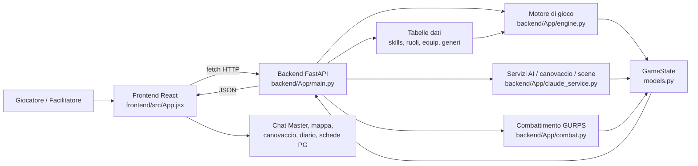
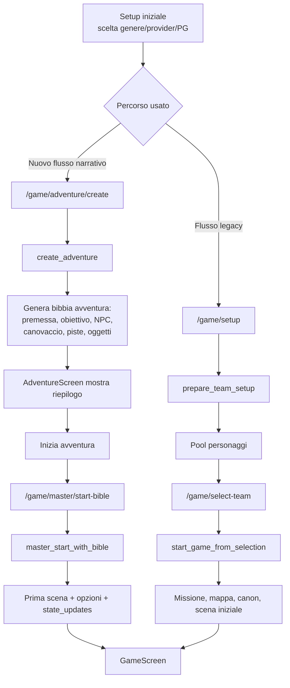
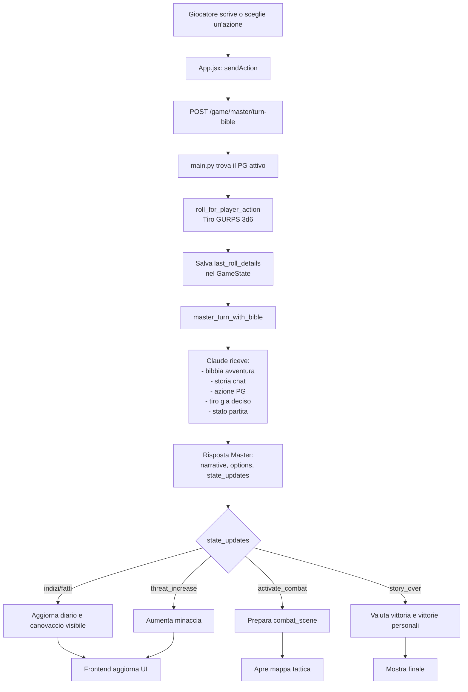
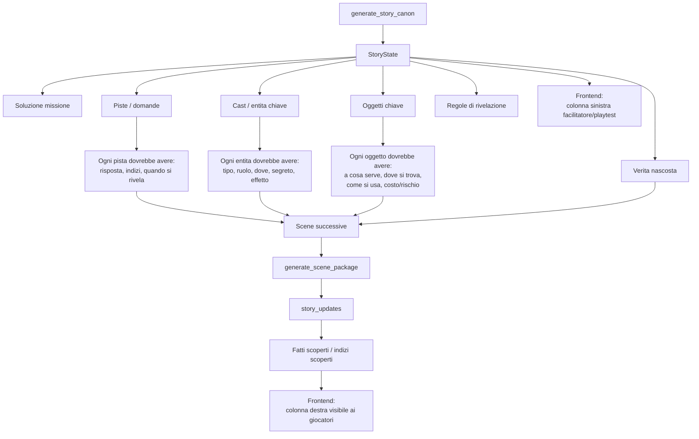
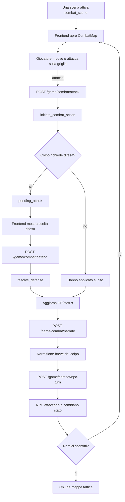
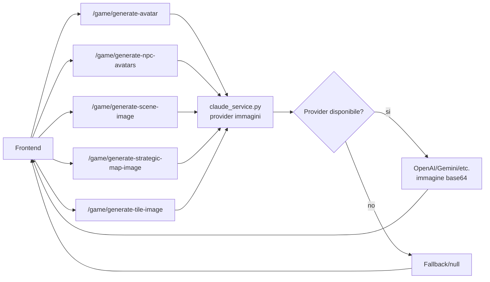
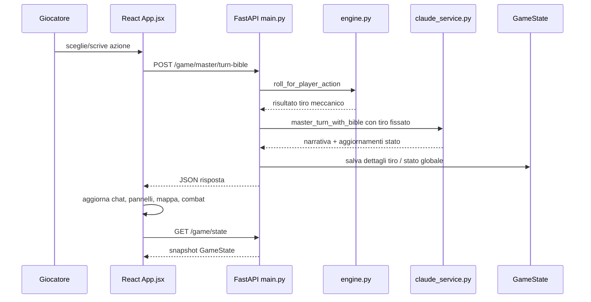

# Flowchart del codice GURPS

Questo documento riassume il flusso reale dell'app: frontend React, backend FastAPI, motore GURPS, generazione narrativa AI, stato missione e combattimento.

## 1. Architettura generale

In pratica:

- `App.jsx` decide cosa mostrare e chiama le API.
- `main.py` espone gli endpoint e conserva il `game_state` globale.
- `engine.py` applica regole, tiri, missione, mappa e stato.
- `claude_service.py` crea missione, canovaccio, scene e aggiornamenti narrativi.
- `combat.py` gestisce attacchi, difese, danni e turni NPC in combattimento.

## 2. Avvio partita

Nota importante: oggi il flusso piu usato e quello "bibbia avventura", cioe `adventure/create` -> `master/start-bible` -> `master/turn-bible`. Il ramo `setup/select-team` resta nel codice come parte storica/legacy e per alcune schermate.

## 3. Turno narrativo principale

Il punto chiave e questo: il tiro viene fatto prima della chiamata narrativa. L'AI non decide se il tiro riesce; riceve gia il risultato meccanico e deve raccontare coerentemente quello.

## 4. Canovaccio, piste e verita nascosta

Qui c'e il problema che stavamo correggendo: il canovaccio deve essere chiuso e leggibile, non generare ogni volta nuovi nomi o piste scollegate. Le scene dovrebbero rivelare o modificare elementi gia definiti.

## 5. Combattimento

Il combattimento e separato dal turno narrativo: usa endpoint dedicati, ma continua ad aggiornare lo stesso `GameState`.

## 6. Mappe e immagini

Le tile della mappa passano anche da `frontend/src/mapTiles/tileCatalog.js`, che prova ad associare tema, tipo stanza e descrizione a una tile coerente.

## 7. Ciclo dati semplificato

## 8. Lettura rapida del codice

Se devi seguire il codice a mano, l'ordine piu utile e:

1. `frontend/src/App.jsx`: parti da `AdventureScreen`, `GameScreen`, `sendAction`, `applyStateUpdates`.
2. `backend/App/main.py`: guarda gli endpoint `/game/adventure/create`, `/game/master/start-bible`, `/game/master/turn-bible`, `/game/combat/*`.
3. `backend/App/engine.py`: guarda `roll_for_player_action`, `start_game_from_selection`, `resolve_actions`.
4. `backend/App/claude_service.py`: guarda `generate_story_canon`, `generate_mission_package`, `generate_scene_package`, `master_turn_with_bible`.
5. `backend/App/models.py`: controlla `GameState`, `StoryState`, `SceneState`, `Player`.

Per il dettaglio specifico della risoluzione scene, vedi anche `docs/scene-resolution-flowchart.md`.

Per il dettaglio del combattimento tattico, vedi anche `docs/tactical-combat-flowchart.md`.
