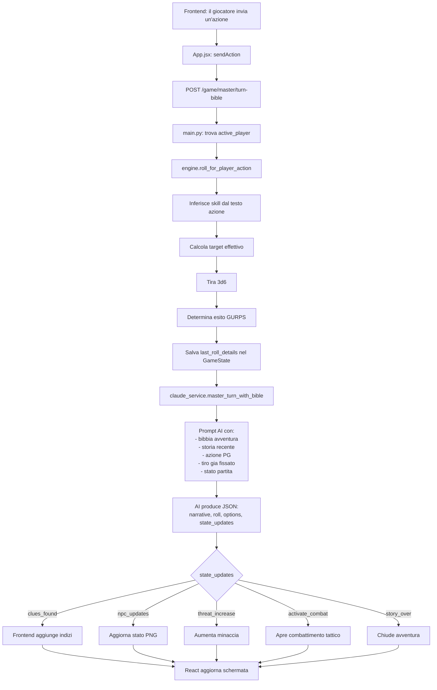
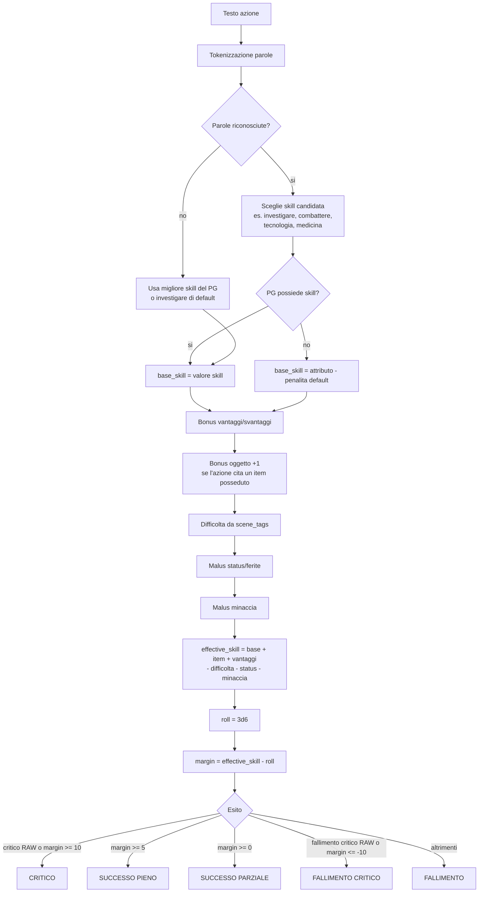
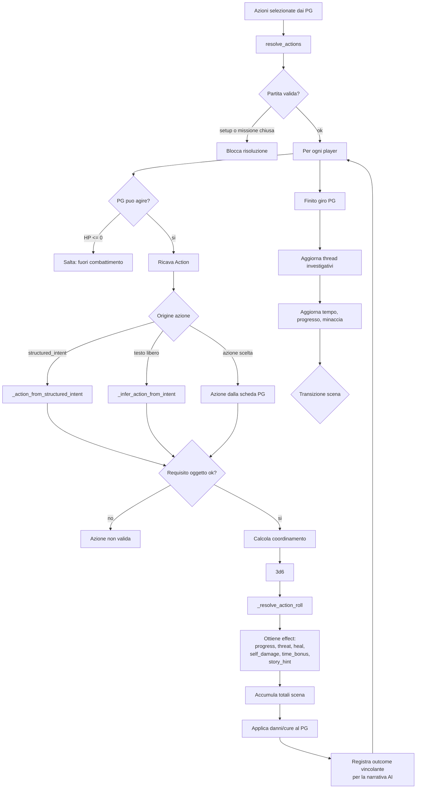
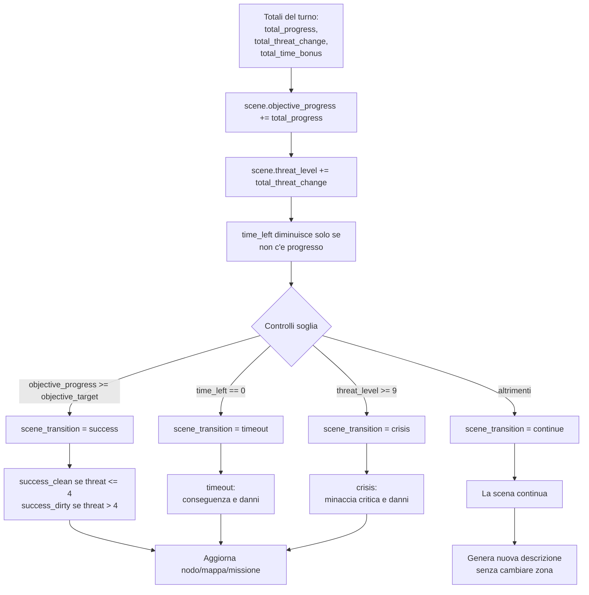
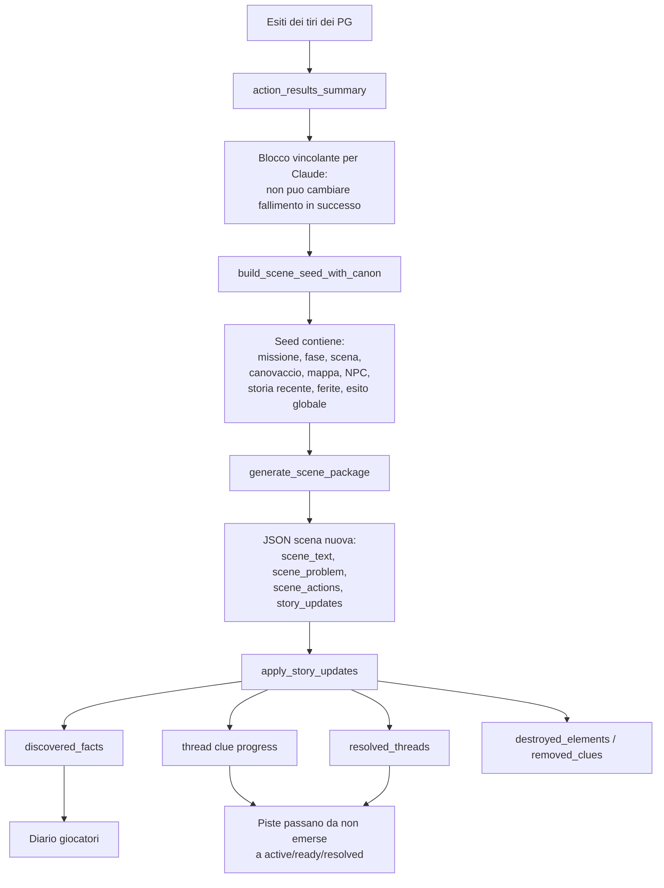
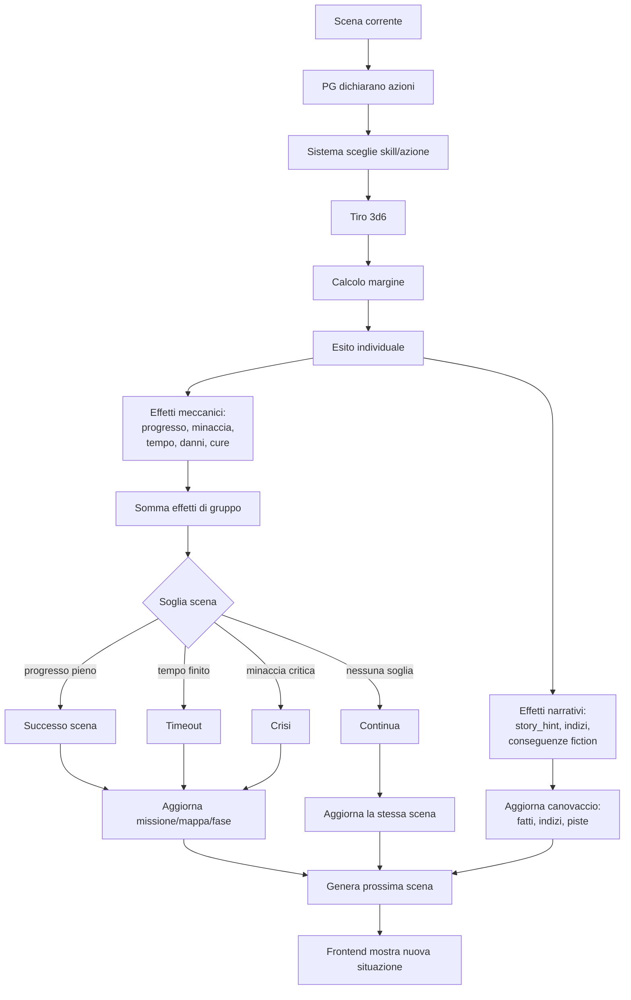
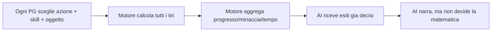

# Flowchart risoluzione scene

Questo documento spiega come il codice calcola la risoluzione di una scena. Al momento esistono due flussi:

- **Flusso attivo nel gioco attuale**: `/game/master/turn-bible`, usato da `GameScreen.sendAction`.
- **Flusso engine multi-personaggio**: `resolve_actions`, piu strutturato, ancora presente in `engine.py`.

## 1. Flusso attivo: turno Master con bibbia

### Formula del tiro nel flusso attivo

Il punto delicato: in questo flusso il motore calcola bene il tiro, ma non calcola direttamente `progresso scena`, `tempo` e `minaccia` con una tabella deterministica. Questi aggiornamenti arrivano soprattutto dal JSON prodotto da `master_turn_with_bible`.

## 2. Flusso engine multi-personaggio: `resolve_actions`

Questo e il flusso piu vicino all'idea "ogni personaggio fa qualcosa nella scena".

## 3. Come viene deciso l'esito globale della scena

Nel flusso `resolve_actions`, dopo aver sommato gli effetti dei personaggi:

## 4. Effetti narrativi e canovaccio

`apply_story_updates` e il punto dove il canovaccio viene effettivamente aggiornato:

- aggiunge fatti scoperti;
- collega gli indizi ai thread tramite `clue_for_thread`;
- porta un thread a `ready` quando ha abbastanza indizi;
- chiude automaticamente thread pronti se l'AI non li chiude;
- ignora i `new_threads` generati a runtime, per mantenere il canovaccio chiuso.

## 5. Diagramma completo della risoluzione scena

## 6. Osservazione di design

Oggi la parte piu solida come calcolo GDR e in `resolve_actions`, perche aggrega piu personaggi e produce progresso/minaccia/tempo. Il flusso realmente usato da `GameScreen` invece passa da `master_turn_with_bible`: e piu semplice da giocare in chat, ma lascia piu decisione all'AI sullo stato scena.

Se vogliamo rendere il gioco piu GDR, il prossimo passo naturale e portare il flusso attivo verso questa forma:

