# Flowchart combattimento tattico

Questo documento descrive come viene risolto il combattimento tattico: dalla mappa esagonale React fino alla matematica GURPS Lite.

## 1. Architettura del combattimento

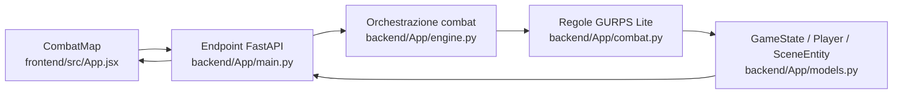

Ruoli principali:

- `CombatMap`: mappa esagonale, movimento, selezione bersaglio, copertura, attacco da retro.
- `main.py`: endpoint `/game/combat/*`.
- `engine.py`: crea `pending_attack`, aggiorna `last_attack_result`, gestisce NPC.
- `combat.py`: calcola attacco, difesa, danno, shock, ferite, knockdown e morte.

## 2. Attivazione del combattimento

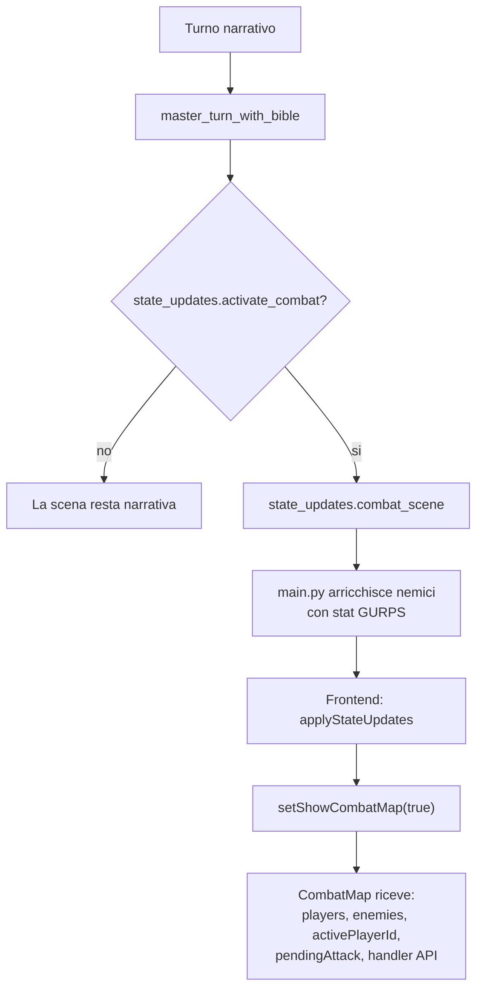

Il combattimento parte quando il Master AI restituisce `activate_combat=true` dentro `state_updates`. Da quel momento il frontend apre la mappa tattica e usa endpoint separati.

## 3. Turno del giocatore sulla mappa

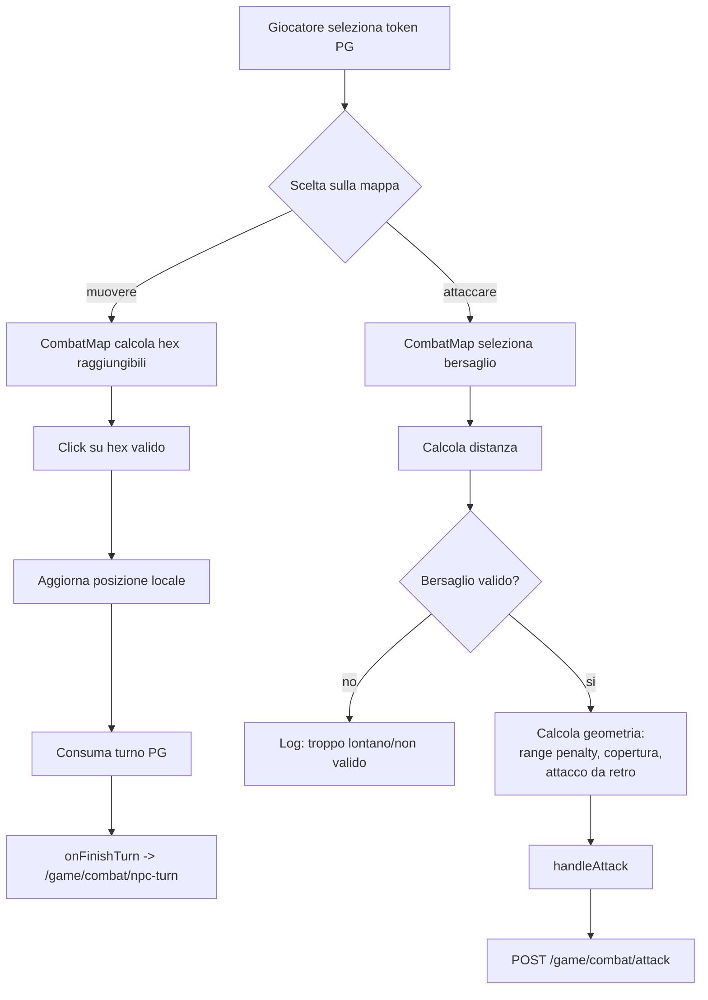

Nota: il movimento sulla mappa e gestito localmente dal frontend; non passa oggi da un endpoint dedicato. L'attacco invece passa dal backend.

## 4. Attacco del giocatore contro un nemico

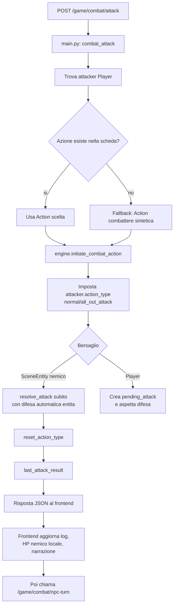

Quando il bersaglio e una `SceneEntity` nemica, il backend risolve subito tutto lo scambio. La difesa non viene scelta dal giocatore: usa `target_entity.active_defense`.

## 5. Attacco contro un personaggio e difesa attiva

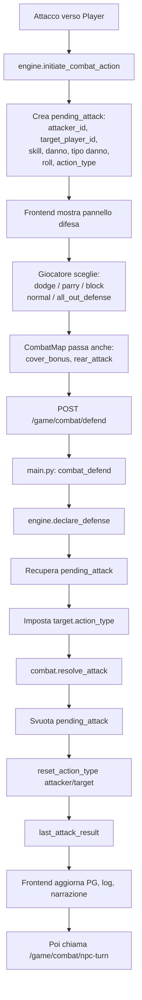

Qui il sistema permette una vera difesa attiva, ma solo quando c'e un `pending_attack`. Gli NPC nel loro turno usano invece una schivata automatica semplificata.

## 6. Matematica GURPS dello scambio

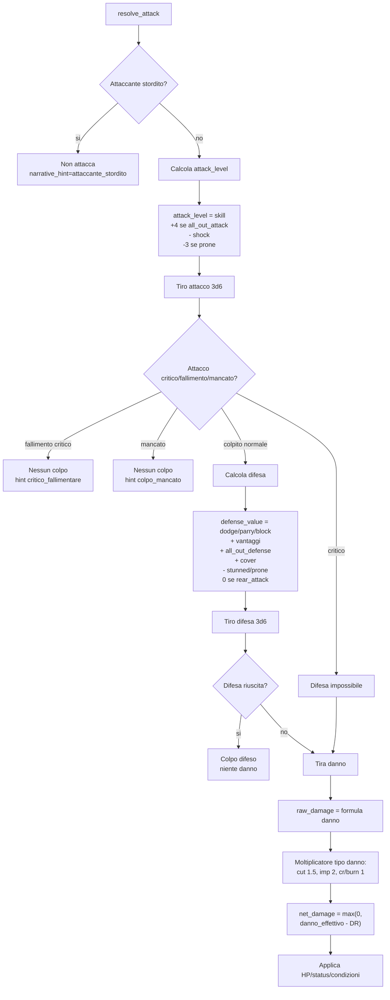

## 7. Danno, ferite e condizioni

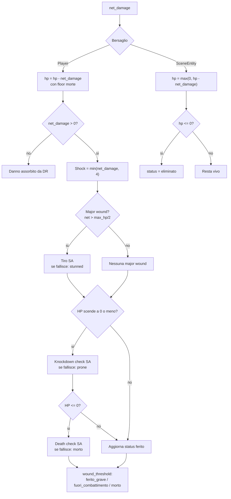

Effetti principali:

- `shock_penalty`: malus al prossimo attacco/difesa, massimo 4.
- `major_wound`: se un colpo supera meta HP massimi.
- `stunned`: il PG deve recuperare con tiro SA prima di agire.
- `prone`: il PG e a terra, ha penalita.
- `death_check`: quando HP scende a 0 o sotto.

## 8. Turno degli NPC

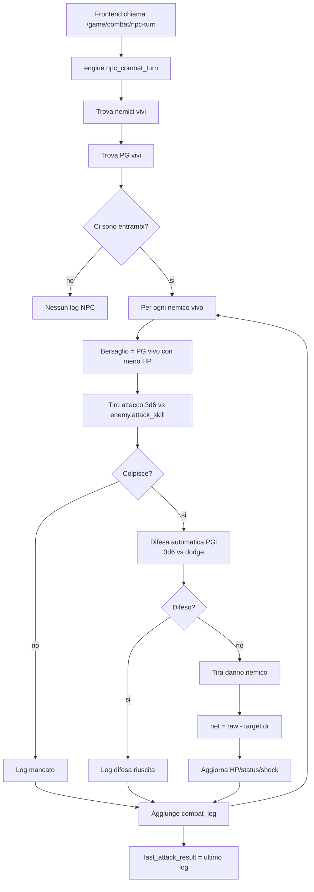

Differenza importante: il turno NPC e piu semplificato di `resolve_attack`. Non usa tutta la stessa funzione `combat.resolve_attack`; ricalcola attacco, schivata e danno direttamente in `engine.npc_combat_turn`.

## 9. Narrazione del colpo

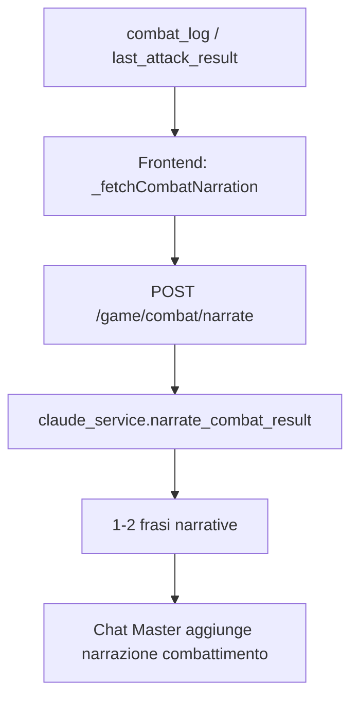

La narrazione del combattimento e successiva alla matematica: riceve gia il `combat_log` e non dovrebbe cambiare il risultato.

## 10. Chiusura combattimento

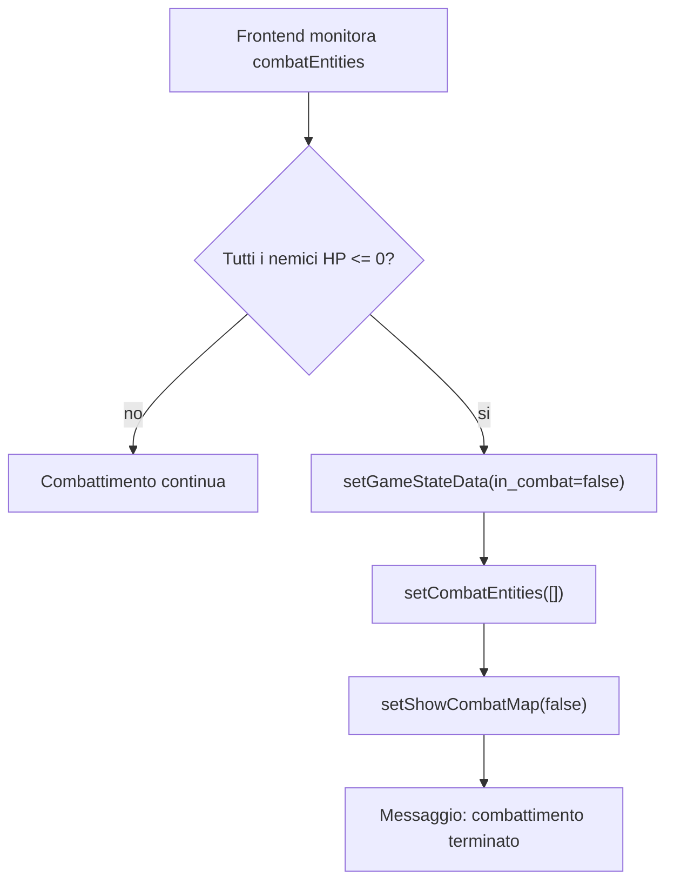

Oggi la chiusura tattica e gestita soprattutto dal frontend quando vede tutti i nemici abbattuti. Il flusso narrativo puo anche chiudere con `state_updates.combat_over`, ma la mappa tattica usa questo controllo locale.

## 11. Diagramma compatto completo

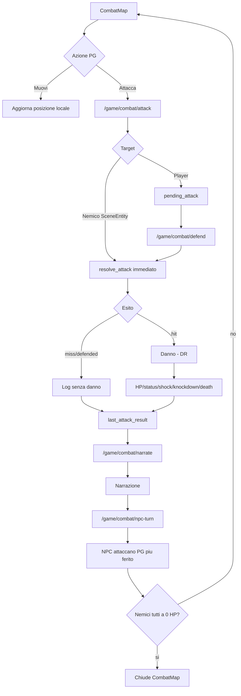
